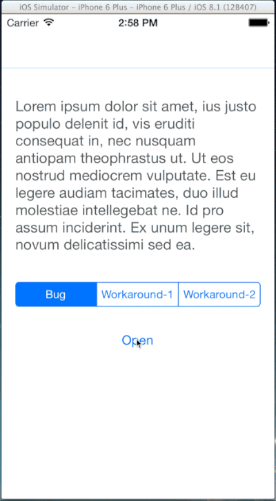

iOS 8 Rendering Bug
============

## Problem

iPhone 6/6 PlusでUIViewのスナップショットAPIを利用する際に、
一瞬画面が拡大されてしまう不具合が発生します。
ちなみにタイトルには"iOS 8"と入ってますが、iOS 7環境でも発現するようです。



**発生条件**

手元で確認している発生条件は以下の通りです。

- iPhone 6/6 Plus対応していない(LaunchScreen。storyboardを利用していない)
- iOS 7から利用できる`drawViewHierarchyInRect:afterScreenUpdates:`を利用している
- `drawViewHierarchyInRect:afterScreenUpdates:`の第２引数に`YES`を渡している。

冒頭で書いたiOS 7での発生条件は

- UniversalアプリではないiPhone用アプリをiPadで実行している。(**未確認**)

です。これらの条件から互換性のために画面をスケールアップ/ダウンしているアプリで発現するものと思われます。

## 回避策

### Workaround 1

`drawViewHierarchyInRect:afterScreenUpdates:`の第２引数に`NO`を渡すことで、この問題を回避できます。
ただし、スナップショットを利用するタイミングによっては`NO`を渡すことで問題が起きる場合あります。

```objc
UIGraphicsBeginImageContextWithOptions(self.bounds.size, NO, 0.0f);

[self drawViewHierarchyInRect:self.bounds afterScreenUpdates:NO];
UIImage *image = UIGraphicsGetImageFromCurrentImageContext();

UIGraphicsEndImageContext();
```

### Workaround 2

iOS 7以前からあるCoreGraphicsのAPIを利用することで回避できます。
しかしこの方法には２つの問題があります。

**パフォーマンス**

`drawViewHierarchyInRect:afterScreenUpdates:`は、従来のAPIに比べてパフォーマンス面でのメリットがあるとWWDC 2013の中で説明されています。従来のAPIを利用することはそのメリットを手放すことになってしまいます。

**Alpha channel support**

サンプルを動かしてもらうとわかりますが、ナビゲーションバーの透過が無効になっています。
コードを工夫することで回避することもできるかもしれませんが、現時点では実現していません。

```objc
UIGraphicsBeginImageContextWithOptions(self.bounds.size, NO, 0.0f);

[self.layer renderInContext:UIGraphicsGetCurrentContext()];
UIImage *image = UIGraphicsGetImageFromCurrentImageContext();

UIGraphicsEndImageContext();
```

iOS 7の時代から修正されていないので問題としては根深いのかもしれません。

### 参考情報 :

- [Technical Q&A QA1817 View Snapshots on iOS 7](https://developer.apple.com/library/ios/qa/qa1817/_index.html)
- [Flickering issue when rotating on iPad](https://github.com/mrackwitz/MRProgress/issues/42)
